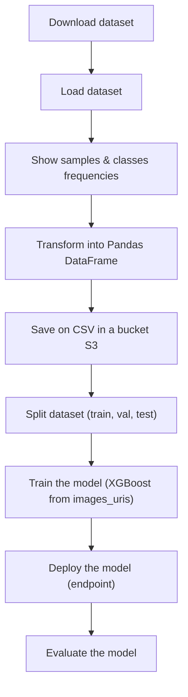
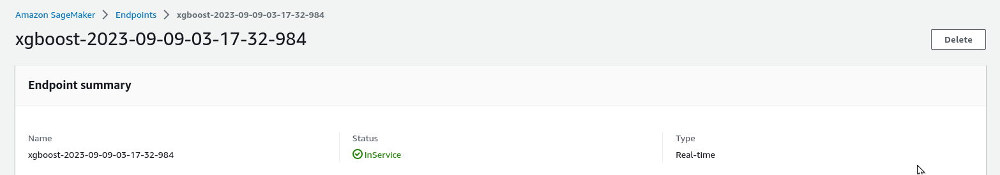
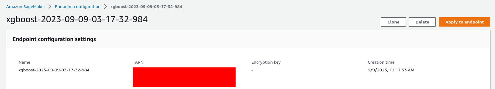
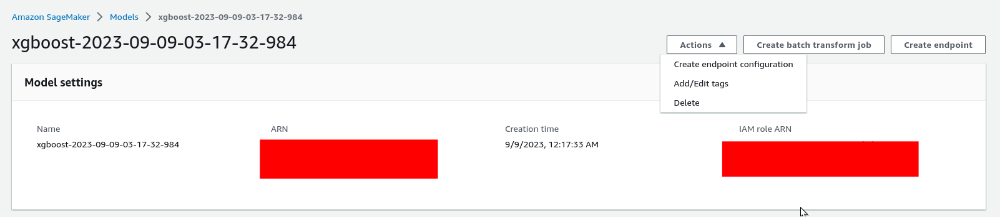
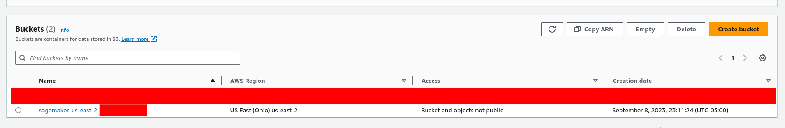
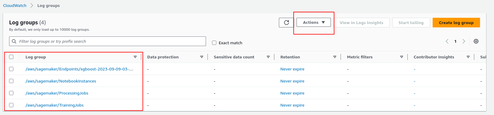

# AWS SageMaker Demo

This is a repo to store my implementation and steps using SageMaker (AWS). Objectives in the end:

- Create notebook instance;
- Save dataset to a default Amazon S3 bucket automatically paired with the SageMaker session;
- Submit a training job of an ML model to Amazon EC2;
- Deploy the trained model for prediction by hosting

# Dataset

I'm using the [sklearn.datasets.load_digits](https://scikit-learn.org/stable/modules/generated/sklearn.datasets.load_digits.html#sklearn.datasets.load_digits) that consists of digits with 8×8 size, it means 64 features (pixels) and 1 target variable (the number).

# SageMaker

## Create notebook instance

1. Go to [https://console.aws.amazon.com/sagemaker/](https://console.aws.amazon.com/sagemaker/) to create the jupyter instance
2. For the first time, we need to create a single user click on `Set up for single user`, and we have to wait for the platform to create our Domain.
3. Now, click on `Notebook` &rarr; `Notebook instances` &rarr; `Create notebook instance`
4. Type the `Notebook instance name` and select the cheapest `Notebook instance type` (ml.t2.medium)
5. In `IAM role` choose `Create new role` and `Create role`
6. In the end: `Create notebook instance`

## Create a Jupyter Notebook

1. Wait until the `Status` is **In-Service**
2. Click on `Open JupyterLab` and will open the notebook in your browser
3. I'm using the kernel `conda_python3`
4. **I download the Jupyter Notebook that I used in my AWS - SageMaker. You can find it here: [SageMaker-Predict-Digit.ipynb](./SageMaker-Predict-Digits.ipynb). The superficial flow representation of the notebook is shown below:**

## Clean up

To avoid incurring unnecessary charges, use the `AWS Management Console` to delete the endpoints and resources that you created while running. I deleted everything created as shown below:

1. Go to the [SageMaker console](https://console.aws.amazon.com/sagemaker/):

   a. Under `Inference`, choose `Endpoints` and `delete`.

   

   b. Under `Inference`, choose `Endpoint configurations` and `delete`.

   

   c. Under `Inference`, choose `Models` and `delete`.

   

   d. Under `Notebook`, choose `Notebook instances` and `delete`.

   

2. Go to the [S3 console](https://console.aws.amazon.com/s3/) and delete the bucket created (you need emptying before deleting)

3. Go to the [CloudWatch console](https://console.aws.amazon.com/cloudwatch/) &rarr; `Log Groups` and delete everything starting with `/aws/sagemaker/`

---

  <strong>"PEOPLE'S DREAMS WILL NEVER END" - OP</strong>

  Created by BrenoAV

